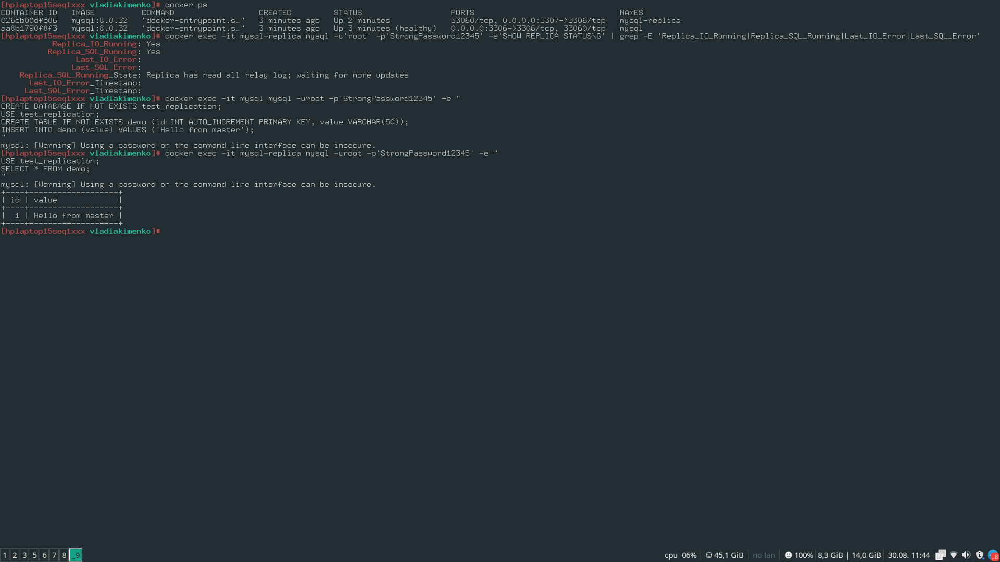
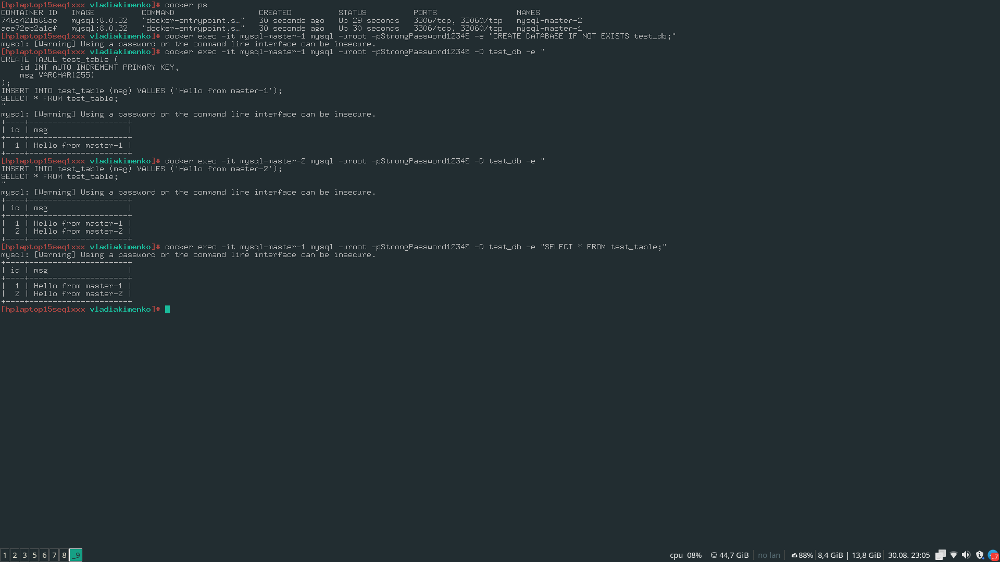

# Домашнее задание к занятию «Репликация и масштабирование. Часть 1»

## Якименко Владимир

---

### Задание 1

На лекции рассматривались режимы репликации master-slave, master-master, опишите их различия.

```
Режим репликации master-slave - это режим при котором одна нода является ведущей, а вторая репликой, и в рамках CQRS подхода write-запросы летят на мастер-ноду, а read-запросы на реплику.  
Направления репликации всегда от мастера в реплику, т.к. все изменения происходят на мастере. 
В рамках подхода master-master происходит перекрёстная репликация, а внесение изменений возможно в обе ноды. Одна нода смотрит в журнал второй и наоборот, и при появлении записей в WAL (binary log для Mysql), синхронизирует изменения.
Подход сложен в реализации и обслуживании и используется значительно реже чем master-slave.
```
---

### Задание 2

Выполните конфигурацию master-slave репликации, примером можно пользоваться из лекции.




---

## Дополнительные задания (со звёздочкой*)
Эти задания дополнительные, то есть не обязательные к выполнению, и никак не повлияют на получение вами зачёта по этому домашнему заданию. Вы можете их выполнить, если хотите глубже шире разобраться в материале.

---

### Задание 3* 

Выполните конфигурацию master-master репликации. Произведите проверку.

```
[vladiakimenko@hplaptop15seq1xxx 12-06]$ sudo ./master-master-init.sh 
[INFO] Cleaning previous deploys...
mysql-master-1
mysql-master-2
mysql-net
[INFO] Starting containers...
68ae87521afdc39efbb142f9b8d5d72037689543dd460e251e2f34d52fab9f45
472a77ff528e164a01ad129a80dc852c676c730f7d67b595cce155f986367d94
e41209f15289661d110499c44f4778fb7f0c385e894e0ec6c8898e5a312d16b7
[INFO] Waiting for mysql-master-1 to be ready...
...........[INFO] mysql-master-1 is ready.
[INFO] Waiting for mysql-master-2 to be ready...
.[INFO] mysql-master-2 is ready.
[INFO] Creating replication user on both masters...
mysql: [Warning] Using a password on the command line interface can be insecure.
mysql: [Warning] Using a password on the command line interface can be insecure.
[INFO] Configuring master-master replication...
mysql: [Warning] Using a password on the command line interface can be insecure.
*************************** 1. row ***************************
             Replica_IO_State: Checking source version
                  Source_Host: mysql-master-2
                  Source_User: repl
                  Source_Port: 3306
                Connect_Retry: 60
              Source_Log_File: 
          Read_Source_Log_Pos: 4
               Relay_Log_File: 472a77ff528e-relay-bin.000001
                Relay_Log_Pos: 4
        Relay_Source_Log_File: 
           Replica_IO_Running: Yes
          Replica_SQL_Running: Yes
              Replicate_Do_DB: 
          Replicate_Ignore_DB: 
           Replicate_Do_Table: 
       Replicate_Ignore_Table: 
      Replicate_Wild_Do_Table: 
  Replicate_Wild_Ignore_Table: 
                   Last_Errno: 0
                   Last_Error: 
                 Skip_Counter: 0
          Exec_Source_Log_Pos: 0
              Relay_Log_Space: 157
              Until_Condition: None
               Until_Log_File: 
                Until_Log_Pos: 0
           Source_SSL_Allowed: No
           Source_SSL_CA_File: 
           Source_SSL_CA_Path: 
              Source_SSL_Cert: 
            Source_SSL_Cipher: 
               Source_SSL_Key: 
        Seconds_Behind_Source: 0
Source_SSL_Verify_Server_Cert: No
                Last_IO_Errno: 0
                Last_IO_Error: 
               Last_SQL_Errno: 0
               Last_SQL_Error: 
  Replicate_Ignore_Server_Ids: 
             Source_Server_Id: 0
                  Source_UUID: 
             Source_Info_File: mysql.slave_master_info
                    SQL_Delay: 0
          SQL_Remaining_Delay: NULL
    Replica_SQL_Running_State: waiting for handler commit
           Source_Retry_Count: 86400
                  Source_Bind: 
      Last_IO_Error_Timestamp: 
     Last_SQL_Error_Timestamp: 
               Source_SSL_Crl: 
           Source_SSL_Crlpath: 
           Retrieved_Gtid_Set: 
            Executed_Gtid_Set: 2691de9b-85da-11f0-a60d-0242ac120002:1-9
                Auto_Position: 1
         Replicate_Rewrite_DB: 
                 Channel_Name: 
           Source_TLS_Version: 
       Source_public_key_path: 
        Get_Source_public_key: 0
            Network_Namespace: 
mysql: [Warning] Using a password on the command line interface can be insecure.
*************************** 1. row ***************************
             Replica_IO_State: Checking source version
                  Source_Host: mysql-master-1
                  Source_User: repl
                  Source_Port: 3306
                Connect_Retry: 60
              Source_Log_File: 
          Read_Source_Log_Pos: 4
               Relay_Log_File: e41209f15289-relay-bin.000001
                Relay_Log_Pos: 4
        Relay_Source_Log_File: 
           Replica_IO_Running: Yes
          Replica_SQL_Running: Yes
              Replicate_Do_DB: 
          Replicate_Ignore_DB: 
           Replicate_Do_Table: 
       Replicate_Ignore_Table: 
      Replicate_Wild_Do_Table: 
  Replicate_Wild_Ignore_Table: 
                   Last_Errno: 0
                   Last_Error: 
                 Skip_Counter: 0
          Exec_Source_Log_Pos: 0
              Relay_Log_Space: 157
              Until_Condition: None
               Until_Log_File: 
                Until_Log_Pos: 0
           Source_SSL_Allowed: No
           Source_SSL_CA_File: 
           Source_SSL_CA_Path: 
              Source_SSL_Cert: 
            Source_SSL_Cipher: 
               Source_SSL_Key: 
        Seconds_Behind_Source: 0
Source_SSL_Verify_Server_Cert: No
                Last_IO_Errno: 0
                Last_IO_Error: 
               Last_SQL_Errno: 0
               Last_SQL_Error: 
  Replicate_Ignore_Server_Ids: 
             Source_Server_Id: 0
                  Source_UUID: 
             Source_Info_File: mysql.slave_master_info
                    SQL_Delay: 0
          SQL_Remaining_Delay: NULL
    Replica_SQL_Running_State: waiting for handler commit
           Source_Retry_Count: 86400
                  Source_Bind: 
      Last_IO_Error_Timestamp: 
     Last_SQL_Error_Timestamp: 
               Source_SSL_Crl: 
           Source_SSL_Crlpath: 
           Retrieved_Gtid_Set: 
            Executed_Gtid_Set: 26ddeb45-85da-11f0-a592-0242ac120003:1-9
                Auto_Position: 1
         Replicate_Rewrite_DB: 
                 Channel_Name: 
           Source_TLS_Version: 
       Source_public_key_path: 
        Get_Source_public_key: 0
            Network_Namespace: 
[INFO] Done.
```



